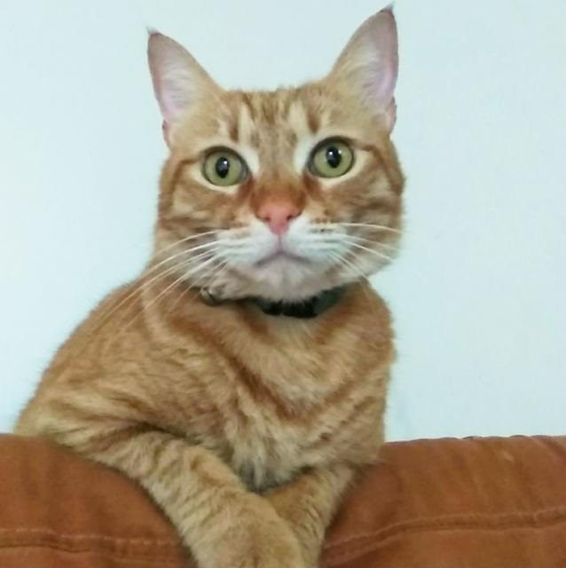
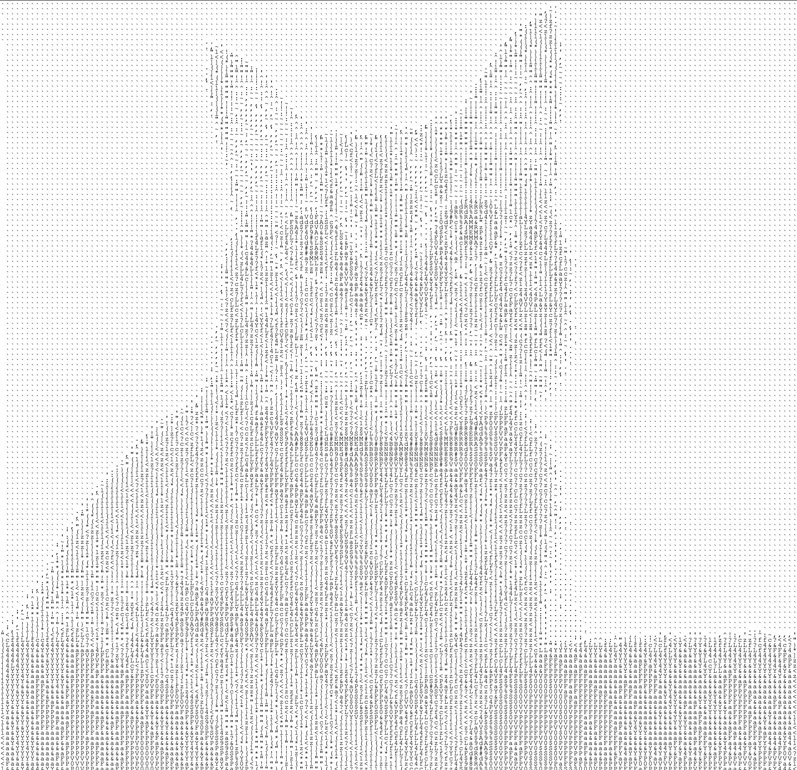

# ASCII Art Generator

**ASCII Art Generator** is a Java-based command-line tool that transforms images into ASCII art. It offers an intuitive interface for users to customize various settings and generate ASCII art according to their preferences.

## Media
<br>
For this input image
<br>

<br><br>
This is the output
<br>

<br>

## Features

- **Image to ASCII Art Conversion**: 
  - Convert any image into stunning ASCII art.

- **Interactive Command-Line Interface**: 
  - Easily configure settings through a user-friendly CLI.

- **Adjustable Resolution and Character Set**: 
  - Customize the resolution and choose your preferred character set.

- **Multiple Output Formats**: 
  - Generate ASCII art for both console and HTML formats.

## Usage

- **Generate ASCII Art**: 
  ```bash
  asciiArt
  ```

- **Modify Character Set**: 
  ```bash
  chars
  ```
  - View and change the character set.

- **Adjust Resolution**: 
  ```bash
  res
  ```
  - Set the desired resolution.

- **Specify Input Image**: 
  ```bash
  image
  ```
  - Choose the input image.

- **Select Output Format**: 
  ```bash
  output
  ```
  - Select between console and HTML output.

## Contributing

We welcome contributions! Feel free to submit bug reports, feature requests, or pull requests to help improve the ASCII Art Generator.

## License

This project is licensed under the MIT License. See the [LICENSE](link_to_LICENSE_file) file for more details.

---

Explore the world of ASCII art with our generator, customize your settings, and create unique artwork from your images. Enjoy and contribute to making this tool even better!
